# Tomcat_y_Maven

## Instalación
Esta práctica empieza con la instalación de `Tomcat` y de `openjdk-11-jdk` concretamente, aparte de esto en la instalción tenemos que crear un grupo y un usuario para tomcat9
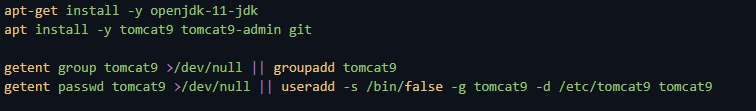.

Para trabajar estaba usando todo el rato un `vagrant reload --provision` para no tener que estar destruyendo la máquina continuamente, y luego tener que levantar la máquina de nuevo (además que a mí me tarda muchísimo en levantar la máquina). 
Es por esto que para que no me salte error tengo que comprobar si el usuario y el grupo ya existe, y si no existe entonces crearlos.

Una vez que tenemos todo instalado y creado, tenemos que arrancar el servicio de tomcat y comprobar su status.
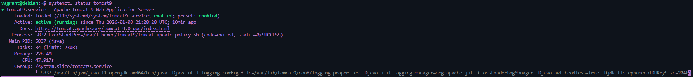.

Ahora solo tenemos que ver si de verdad funciona, para esto usaremos `nip.io`, y ver si nos sale el pantallazo de muestra en la página igual que lo vemos en la explicación de la práctica.
Para esto tenemos que poner la ip de nuestra máquina en el navegador, seguida por nip.io y luego el puerto indicado que en este caso es `:8080`.
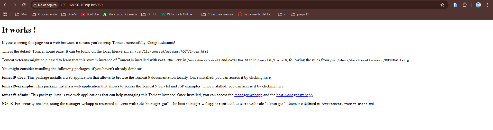.

Para esto deberiamos de tener el `context.html`, el cual se nos proporciona para realizar la práctica solo tendremos que pasarselo a la máquina haciendo un `cp`.
.

## Configuración de la administración

Para continuar con la configuración tenemos que definir un usuario con acceso a Tomcat, para esto tenemos que pasarle el archivo de `tomcat-users.xml` a la máquina, para esto usamos el comando `cp` de nuevo.
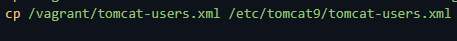.

Una parte importante es instalar el administrador de tomcat, para esto tenemos que añadir la línea de `apt install -y tomcat9-admin`.
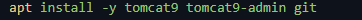.

Ahora podremos acceder al enlace `http://192.168.56.10:8080/manager/html` y ver la pantalla de administración de tomcat.
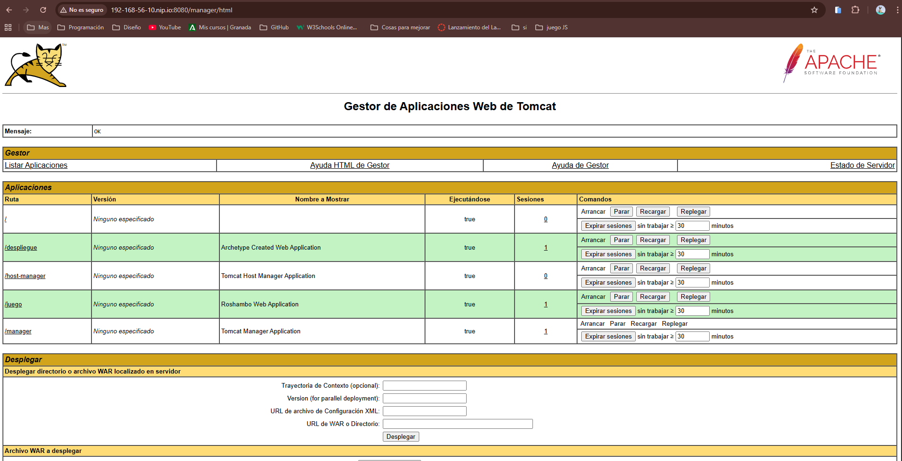.
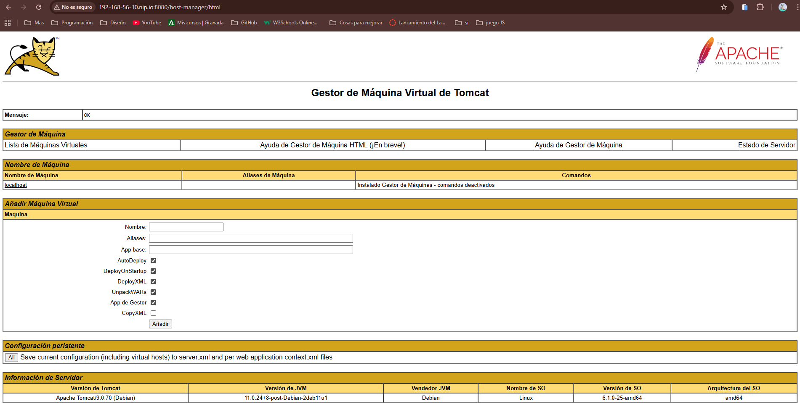.

Nos tenemos que logear con el usuario que hemos creado anteriormente, descargarnos el archivo `tomcat1.war` y tenemos que subirlo a la seccion concreta que nos pone en la explicación de la práctica, luego examinar y por ultimo desplegar, de esta manera podremos acceder a ella.
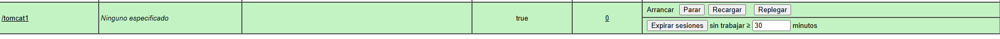.

## Instalación de Maven

Ahora tenemos que añadir los comandos necesarios al `bootstrap.sh` para proceder con la instalción de maven, y luego podemos comprobar la versión de maven que tenemos instalada.
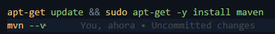.

Ahora tenemos que crear un archivo llamado `settings.xml`, tenemos que sacarlo de nuestra máquina como hemos realizado en otras prácticas, para luego modificarlo con la información que nos proporciona en la explicación, además de esto quito los comentarios para que quede todo más limpio.
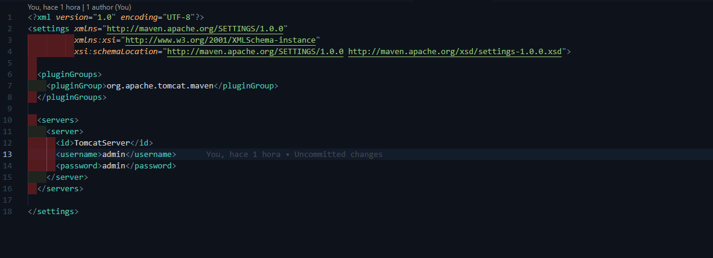.

Finalmente en esta parte de esta sección concreta tenemos que desplegar la aplicación de prueba, para esto tenemos que añadir los comandos necearios en el `bootstrap.sh`, para poder desplegarla, así de esta manera que se realizará el despliegue de forma automática cuando levantemos la máquina.
Pero por el mismo motivo de `reload`, primero tenemos que borrar la aplicación y luego volver a desplegarla.
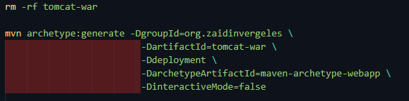.

Ahora los cambios que tenemos que hacer son en el `pom.xml` de la aplicación, solo tenemos que crear un archivo fuera llamado `pom.xml` y pasarlo con `cp` al interior de la máquina, igual que ya hemos realizado con otros archivos anteriormente. 
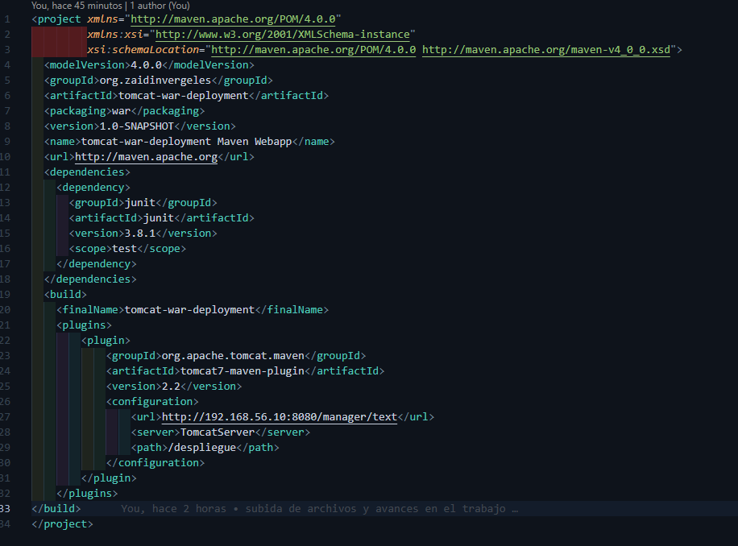.

Y para el despliegue de la aplicación podemos ir comprobando el archivo con los comandos `mvn tomcat7:deploy`, `mvn tomcat7:redeploy` y `mvn tomcat7:undeploy`. 

Ahora podemos ir a visualizar el ejemplo.
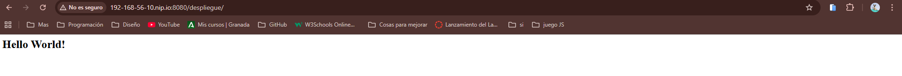.

## Tarea
Para esta tarea, la voy a hacer clonando el proyecto de `https://github.com/cameronmcnz/rock-paper-scissors.git`, con un pom externo y diferente al que he utilizado anteriormente, para pasarlo de nuevo a la máquina, con la configuración necesaria, y para su posterior despliegue. 
La configuración del `bootstrap.sh` sería la siguiente: 
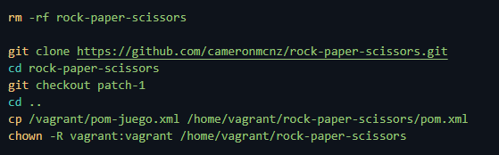.

Y la del `pom-juego.xml` es esta: 
.

Por último para esta práctica vamos a ver los comandos necearios en el `bootstrap.sh` para desplegar a la vez el juego y el ejemplo de la práctica.
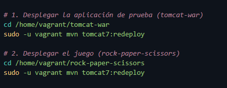.

Una vez que tenemos esto solo tenemos que cambiar la url para ver justo lo que nosotros queramos, si queremos ver el juego entramos a `/juego` y si queremos ver el ejemplo entramos a `/despliegue`.
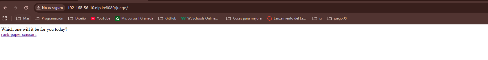.